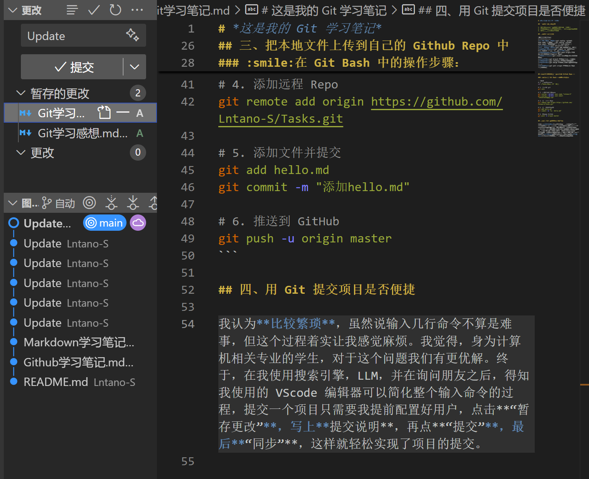

# *这是我的 Git 学习笔记*

## 一、Git 的主要特点

1. 版本控制：通过提交来保存我的开发成果
2. 分支管理：每个分支可以并行开发，做到互不干扰
3. 可以离线在本地修改文件 

## 二、Git 常用命令

|功能|命令|说明|
|---|----|----| 
|**配置用户名和邮箱**|git config --global user.name "用户名" ; git config --global user.email "邮箱地址"|标注 Contributor |
|**初始化仓库**|git int|做好准备工作|
|**添加文件到暂存区**|git add 文件名|草稿版本|
|**提交到本地仓库**|git commit -m "提交说明(一般用 Update )"|上传草稿到**本地**仓库|
|**推送代码到远程Repo**|git push origin 分支名|把本地代码同步到远程 Repo|
|**克隆远程仓库**|git clone 仓库地址|下载别人的代码|
|**创建分支**|git branch 分支名|创建独立章节|
|**切换分支**|git checkout 分支名|切换章节|
|**合并分支**|git merge 分支名|把不同章节合并到主线|
|**拉取代码**|git pull origin 分支名|从 Repo 中拉取代码|


## 三、把本地文件上传到自己的 Github Repo 中

### :smile:在 Git Bash 中的操作步骤：

```bash
# 1. 进入项目目录
cd ~/Tasks/阶段二学习成果

# 2. 初始化 git
git init

# 3. 配置我的用户信息
git config --global user.name "Lntano-S"
git config --global user.email "1932474243@qq.com"

# 4. 添加远程 Repo
git remote add origin https://github.com/Lntano-S/Tasks.git

# 5. 添加文件并提交
git add hello.md
git commit -m "添加hello.md"

# 6. 推送到 GitHub
git push -u origin master
```

## 四、用 Git 提交项目是否便捷

我认为**比较繁琐**，虽然说输入几行命令不算是难事，但这个过程着实让我感觉麻烦。我觉得，身为计算机相关专业的学生，对于这个问题我们有更优解。终于，在我使用搜索引擎，LLM，并在询问朋友之后，得知我使用的 VScode 编辑器可以简化整个输入命令的过程，提交一个项目只需要我提前配置好用户，点击 **“暂存更改”**，写上 **提交说明**，再点 **“提交”**，最后 **“同步”**，这样就轻松实现了项目的提交。

如下图：

